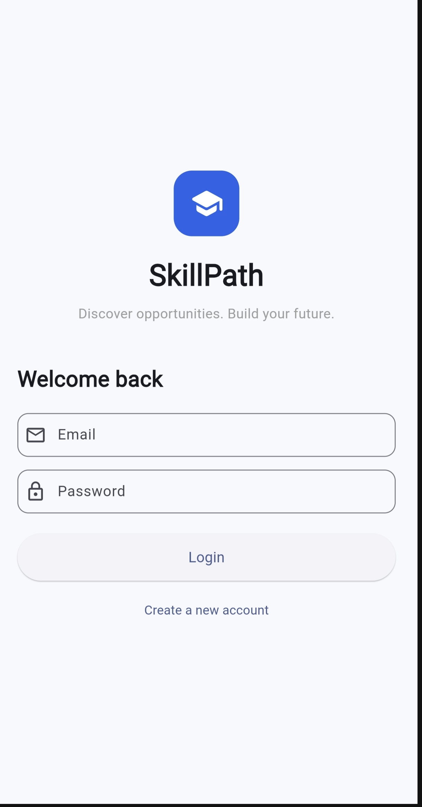
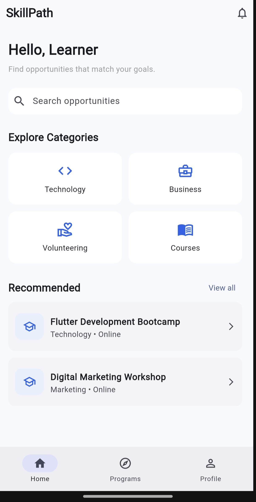
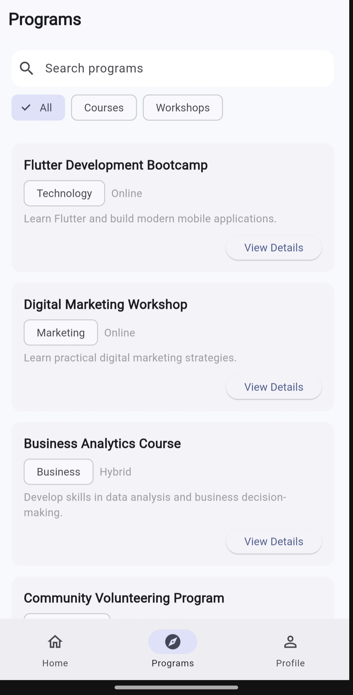
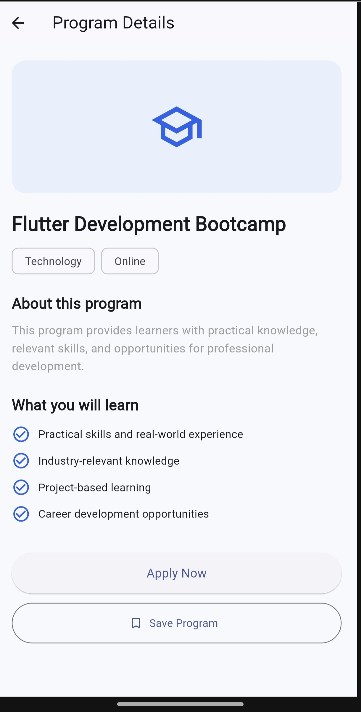

# SkillPath – Week 2 UI Prototype

SkillPath is a Flutter-based mobile application prototype for discovering learning and career opportunities.

## Week 2 Features

- Login Screen
- Home Screen
- Program Listing Screen
- Program Details Screen
- Interactive navigation
- Search and category filters
- SkillPath branding
- Bottom navigation

## Screenshots

### Login

### Home

### Programs

### Program Details

## Technology

- Flutter
- Dart
- Material UI
- GitHub Codespaces

## User Flow

`Login → Home → Programs → Program Details`

## Week 2 Progress

The Week 1 wireframes have been converted into a functional Flutter UI prototype with navigation between the core screens.

The project was tested using `flutter analyze` successfully.

## Demo

A screen-recorded walkthrough demonstrates the navigation and functionality of the Week 2 prototype.